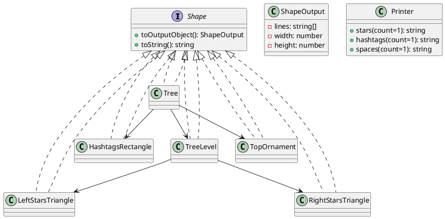

<!-- docs\index.md -->

## **Interfaces and Contracts**

### **ShapeOutput Interface**

- **Purpose:** Standardizes the _rendered output_ of a shape.
- **Structure:**
  - `lines: string[]` — the rendered shape as an array of string lines.
  - `width: number` — the total width of the shape.
  - `height: number` — the total height of the shape.

### **Shape Interface**

- **Purpose:** Abstract contract that all shapes must fulfill.
- **Methods:**
  - `toOutputObject(): ShapeOutput` — returns the structured output.
  - `toString(): string` — returns the shape as a string.

---

## **Printer Utility Class**

- **Purpose:** Gathers reusable string-building logic (DRY principle).
- **Static Methods:**
  - `stars(count = 1)`: returns a string of `count` stars (`*`).
  - `hashtags(count = 1)`: returns a string of `count` hashtags (`#`).
  - `spaces(count = 1)`: returns a string of `count` spaces.

---

## **Shape Implementations**

### **HashtagsRectangle**

- **Purpose:** Draws a rectangle using hashtags.
- **Constructor Args:** `height`, `width`, `offset`.
- **Algorithm:**
  - For each row:
    - Prefix with spaces (offset)
    - Append `width` hashtags

  - Store each row as a line.

- **Output:**
  - Lines with offset + hashtags.

---

### **LeftStarsTriangle**

- **Purpose:** Renders a left-aligned ASCII triangle using `/` and stars.
- **Constructor Arg:** `size`.
- **Algorithm:**
  - For each row from `0` to `size-1`:
    - Prefix with `size - row` spaces
    - Add `/`
    - Add `row` stars.

- **Output:**
  - Shape grows wider per row.

---

### **RightStarsTriangle**

- **Purpose:** Renders a right-aligned ASCII triangle using `|`, stars, and `\`.
- **Constructor Arg:** `size`.
- **Algorithm:**
  - For each row from `0` to `size-1`:
    - Prefix with `|`
    - Add `row` stars
    - Append `\`

- **Output:**
  - Shape grows wider per row.

---

### **TreeLevel**

- **Purpose:** Composes a single "layer" of the tree by merging triangles.
- **Constructor Args:** `height`, `level`, `offset`.
- **Algorithm:**
  1. Create left and right triangles with height = `height + level`.
  2. For each row from `level` up to `height + level - 1`:
     - Prefix with `offset` spaces
     - Concatenate left and right triangles at this row.

- **Output:**
  - Lines that form one layer of the tree.

---

### **TopOrnament**

- **Purpose:** Renders the tree’s "star" or ornament.
- **Constructor Arg:** `levelHeight`.
- **Algorithm:**
  - Calculate center offset based on tree width.
  - Place a single `+` at the center.

---

### **Tree**

- **Purpose:** Main composite shape; assembles all pieces.
- **Constructor Arg:** `levelHeight` (size parameter).
- **Algorithm:**
  1. **Compute width:** `4 * levelHeight + 2`
  2. **Top Ornament:** Place ornament at the center.
  3. **Tree Levels:** For each row in `0..levelHeight`:
     - Add a `TreeLevel` with:
       - height: `levelHeight`
       - level: current row
       - offset: `levelHeight - row`

  4. **Trunk:** Add a `HashtagsRectangle` of width `levelHeight`, offset to center.
  5. **Cleanup:** Remove any blank lines.

- **Output:**
  - Complete tree as ASCII art.
  - Returns structured output with width and height.

- **Extra Methods:**
  - `print()` — prints string representation.
  - `output()` — logs object output.

---

## **Testing Algorithm**

### **Printer Utility**

- Tests whether repeated characters are generated correctly for stars, hashtags, spaces.

### **Shape Implementations**

- **HashtagsRectangle:**
  - Validates rectangle output (with offsets and correct rows).

- **LeftStarsTriangle / RightStarsTriangle:**
  - Validates correct line-by-line shape, using ASCII expectations.

- **TopOrnament:**
  - Ensures the ornament is centered.

- **TreeLevel:**
  - Checks combination of triangles and composition.

- **Tree:**
  - "Smoke test": Verifies presence of expected ASCII components (`+`, `/`, `|`, `\`).
  - Validates `toOutputObject()` dimensions.

---

## **Design Patterns and Structure**

- **Abstraction:** All shapes share a common interface for flexible composition.
- **Composition:** Complex shapes (TreeLevel, Tree) are built from simpler shapes.
- **Encapsulation:** Internal logic is hidden; all external output goes through `toOutputObject()` and `toString()`.
- **Reusability:** Printer utility reduces repetition.
- **Testing:** Each module is validated in isolation for correctness.

---

## 6. **Algorithmic Flow for Drawing a Tree**

**Input:** `levelHeight`

1. Compute overall tree width for centering.
2. Place the ornament at the calculated center.
3. For each tree layer:
   - Build and join the corresponding left and right triangles.
   - Offset them for symmetry.

4. Add the trunk, centered under the foliage.
5. Remove any blank or whitespace-only lines.
6. Return the assembled ASCII tree as both string and structured object.

---

## **Summary Table**

| Class/Interface        | Responsibility                            | Algorithmic Principle          |
| ---------------------- | ----------------------------------------- | ------------------------------ |
| `Printer`              | String generation utilities               | DRY, static utility            |
| `Shape`, `ShapeOutput` | Contracts for shapes and their outputs    | Polymorphism, abstraction      |
| `HashtagsRectangle`    | Render rectangles with hashtags           | Row-wise generation            |
| `LeftStarsTriangle`    | Left-aligned ASCII triangles              | Row-wise composition           |
| `RightStarsTriangle`   | Right-aligned ASCII triangles             | Row-wise composition           |
| `TreeLevel`            | Layer of the tree (composed of triangles) | Composition, merging shapes    |
| `TopOrnament`          | Top-center ASCII ornament                 | Center calculation             |
| `Tree`                 | Complete ASCII tree                       | Composition, offset management |

## **Pseudocode for Key Classes and Tree Rendering**

### **Printer Utility**

```plaintext
Class Printer:
    Method stars(count = 1):
        Return string of '*' repeated count times

    Method hashtags(count = 1):
        Return string of '#' repeated count times

    Method spaces(count = 1):
        Return string of ' ' repeated count times
```

---

### **ShapeOutput Interface**

```plaintext
ShapeOutput:
    lines: list of strings
    width: number
    height: number
```

---

### **Shape Interface**

```plaintext
Shape:
    toOutputObject() returns ShapeOutput
    toString() returns string
```

---

### **HashtagsRectangle**

```plaintext
Class HashtagsRectangle implements Shape:
    Constructor(height, width, offset = 0)
    Method toOutputObject():
        lines = []
        For i in 0 to height - 1:
            line = Printer.spaces(offset) + Printer.hashtags(width)
            lines.append(line)
        Return ShapeOutput(lines, offset + width, height)

    Method toString():
        Return join lines with newline
```

---

### **LeftStarsTriangle**

```plaintext
Class LeftStarsTriangle implements Shape:
    Constructor(size)
    Method toOutputObject():
        lines = []
        For row in 0 to size - 1:
            line = Printer.spaces(size - row) + '/' + Printer.stars(row)
            lines.append(line)
        Return ShapeOutput(lines, size + 1, size)

    Method toString():
        Return join lines with newline
```

---

### **RightStarsTriangle**

```plaintext
Class RightStarsTriangle implements Shape:
    Constructor(size)
    Method toOutputObject():
        lines = []
        For row in 0 to size - 1:
            line = '|' + Printer.stars(row) + '\\'
            lines.append(line)
        Return ShapeOutput(lines, size + 1, size)

    Method toString():
        Return join lines with newline
```

---

### **TreeLevel**

```plaintext
Class TreeLevel implements Shape:
    Constructor(height, level, offset = 0)
    Method toOutputObject():
        leftLines = LeftStarsTriangle(height + level).toOutputObject().lines
        rightLines = RightStarsTriangle(height + level).toOutputObject().lines
        lines = []
        indentation = Printer.spaces(offset)
        For row in level to (height + level - 1):
            line = indentation + leftLines[row] + rightLines[row]
            lines.append(line)
        Return ShapeOutput(lines, offset + (height + level + 1) * 2, height)

    Method toString():
        Return join lines with newline
```

---

### **TopOrnament**

```plaintext
Class TopOrnament implements Shape:
    Constructor(levelHeight)
    Method toOutputObject():
        ornamentOffset = floor((4 * levelHeight + 2) / 2)
        lines = [Printer.spaces(ornamentOffset) + '+']
        Return ShapeOutput(lines, ornamentOffset + 1, 1)

    Method toString():
        Return join lines with newline
```

---

### **Tree**

```plaintext
Class Tree implements Shape:
    Constructor(levelHeight = 1)
    Method toOutputObject():
        totalWidth = 4 * levelHeight + 2
        trunkWidth = levelHeight
        trunkOffset = ceil((totalWidth - trunkWidth) / 2)
        lines = []

        // Add top ornament
        lines += TopOrnament(levelHeight).toOutputObject().lines

        // Add each tree level (branches)
        For row in 0 to levelHeight:
            level = TreeLevel(levelHeight, row, levelHeight - row)
            lines += level.toOutputObject().lines

        // Add trunk
        trunk = HashtagsRectangle(levelHeight, trunkWidth, trunkOffset)
        lines += trunk.toOutputObject().lines

        // Filter blank lines
        finalLines = filter out lines where trim(line) == ""

        Return ShapeOutput(finalLines, totalWidth, length(finalLines))

    Method toString():
        Return join lines with newline

    Method print():
        Print self.toString()

    Method output():
        Print "Tree as output object:", self.toOutputObject()
```

---

## **Flowchart-Style Structure**

### **Tree Rendering Flowchart**

```plaintext
[Start]
   |
   v
[Create Tree Object (with levelHeight)]
   |
   v
[Calculate totalWidth, trunkWidth, trunkOffset]
   |
   v
[Add Top Ornament]
   |
   v
[For row in 0..levelHeight:]
   |       (repeat for each tree level)
   v
   [Create TreeLevel (branches)]
   |
   v
[Add TreeLevel lines to output]
   |
   v
[Add Trunk (HashtagsRectangle)]
   |
   v
[Remove blank lines]
   |
   v
[Return ShapeOutput: lines, width, height]
   |
   v
[Print as string or log as object]
   |
   v
[End]
```

---

### **TreeLevel Flowchart (Subcomponent)**

```plaintext
[Start TreeLevel]
   |
   v
[Generate left triangle lines]
   |
   v
[Generate right triangle lines]
   |
   v
[For each row in level..(height+level-1):]
   |      (repeat for this level's rows)
   v
   [Indent line by offset]
   |
   v
   [Concatenate leftLine[row] + rightLine[row]]
   |
   v
[Collect lines for this level]
   |
   v
[Return ShapeOutput]
   |
   v
[End TreeLevel]
```

---

## **Summary Table of Data Flow**

| Step              | Input                 | Processing                    | Output                 |
| ----------------- | --------------------- | ----------------------------- | ---------------------- |
| Tree              | levelHeight           | Calculate width, offsets      | Lines of tree          |
| TreeLevel         | height, level, offset | Compose triangles, indent     | Lines for tree level   |
| LeftTriangle      | size                  | Row-wise string generation    | Triangle lines (left)  |
| RightTriangle     | size                  | Row-wise string generation    | Triangle lines (right) |
| HashtagsRectangle | height, width, offset | Row-wise string with hashtags | Rectangle lines        |
| TopOrnament       | levelHeight           | Center ornament               | Ornament line          |

## **ASCII Block Diagram (High-Level Composition)**

```plaintext
+-------------------+
|      Printer      |
| (static helpers)  |
+--------+----------+
         ^
         |
+--------+----------+
|      Shape        |<-------------------+
|  (interface)      |                    |
+--------+----------+                    |
         ^                               |
         |             +-----------------+------------------+
         |             |                 |                  |
+--------+--------+  +----------------+ +----------------+ +--------------------+
| HashtagsRect.   |  | LeftStarsTri.  | | RightStarsTri. | |  TopOrnament       |
+--------+--------+  +--------+-------+ +--------+-------+ +--------------------+
         ^                    ^                  ^                   ^
         |                    |                  |                   |
         +----------+---------+                  |                   |
                    |                            |                   |
                    v                            v                   v
                +---+----------------+      +----+-----------------+
                |     TreeLevel      |<-----+    Tree (composite)  |
                +--------------------+      +----------------------+

```

- **Arrows** show _composition_ or "uses".
- The **Tree** class _composes_ TopOrnament, TreeLevel, and HashtagsRectangle.
- **TreeLevel** _composes_ LeftStarsTriangle and RightStarsTriangle.
- All shape classes implement the **Shape** interface.

---

## **PlantUML Class Diagram**



---

## **ASCII Sequence of Tree Construction**

```plaintext
[ Tree ]
   |
   |---> [ TopOrnament ]
   |
   |---> [ TreeLevel ] (for each level)
   |         |---> [ LeftStarsTriangle ]
   |         |---> [ RightStarsTriangle ]
   |
   |---> [ HashtagsRectangle ] (trunk)
```

---

**In summary:**
This code is an object-oriented, compositional ASCII art engine. It uses utility classes, clear contracts, and composition to enable rich, testable ASCII shape rendering, particularly for a decorative tree.
